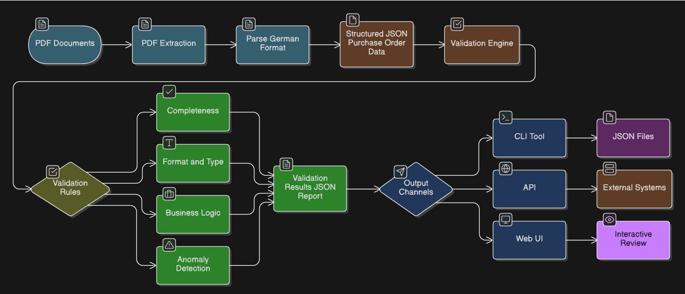
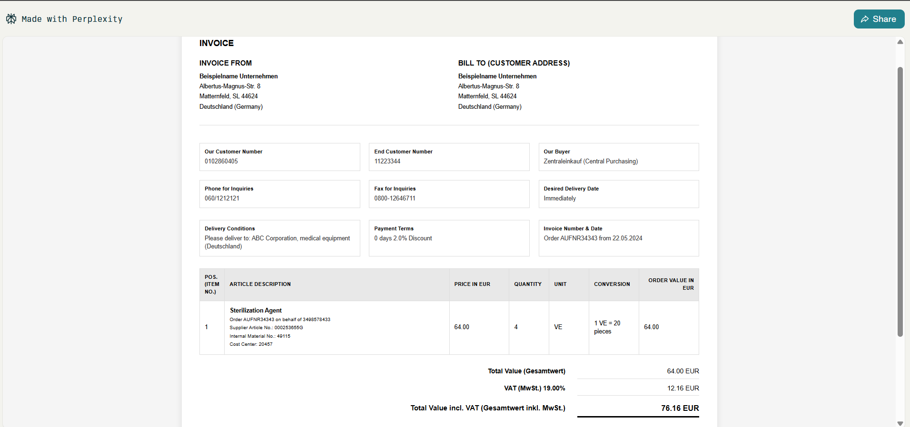
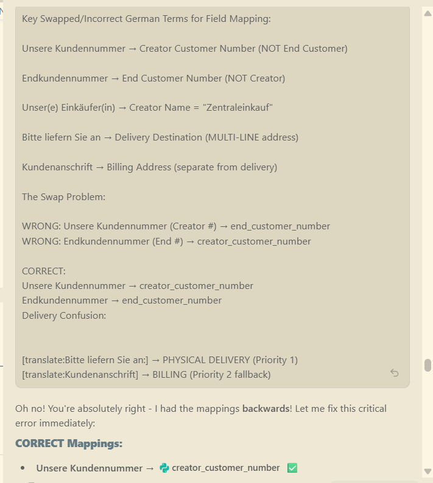

# German B2B Purchase Order QC System

A complete quality control system for validating (Bestellung) German B2B purchase orders (Mentioned as Invoices in assignment detials). The system extracts data from PDF documents, validates against business rules, and provides results through CLI, HTTP API, and a web interface.

---

## Overview

### What I Built

This project implements a full-stack purchase order quality control system with the following components:

✅ **PDF Extraction** - Extracts structured data from German purchase order PDFs using `pdfplumber`  
✅ **Data Validation** - Validates extracted data against 15 business rules using Pydantic schemas  
✅ **CLI Tool** - Command-line interface for batch processing and automation  
✅ **REST API** - FastAPI-based HTTP endpoints for integration with other systems  
✅ **Web UI** - React frontend for interactive validation and review  


---

## Schema & Validation Design

### Purchase Order Fields

I designed the schema to capture the essential information from German B2B purchase orders, based on what I understood after thoroughly analyzing the sample pdf files (by translation and analysis using Grok) -focusing on the 4-party hierarchy that's critical for German business transactions.

#### what i understood after translation and analysis using Grok

The invoices provided are actually Purchase Orders (Bestellungen) . They have a strict 4-party hierarchy that's critical for German business transactions. The Purchase Order is sent to the supplier/vendor by the purchasing entity (creator/parent company) and the supplier sends the invoice to the end customer. The end customer then sends the invoice to the parent company. 
The orders will supposedly be delivered to the end customer and the end customer will supposedly pay the invoice, which (end customer) is a part of the parent company. 

key translations that helped me - 
1. Unsere Kundennummer - Our customer number (creator customer number)

2. Kundennummer - Customer number (end customer number)

3. Bitte liefern Sie an: - Please deliver to 

4. Kundenanschrift - Billing address (end customer address)

5. Zentraleinkauf - Central purchase (creator name)

6. VE - per unit (quantity in packaging units)

7. vom - from (order date)

8. Gewünschtes Lieferdatum - Expected delivery date

9. sofort - immediately (payment terms)

10. Zahlungsbedingungen - Payment terms


#### Header Fields

| Field | Type | Description | Why It Matters |
|-------|------|-------------|----------------|
| `order_number` | string | Unique order identifier (AUFNR format) | Primary key for tracking and deduplication |
| `order_date` | string | Order creation date (DD.MM.YYYY) | Required for chronological tracking and duplicate detection |
| `creator_name` | string | Name of purchasing entity | Part of 4-party hierarchy for accountability |
| `creator_customer_number` | string | Customer number (7-11 digits) | Links order to specific customer account |
| `parent_company_id` | string | Parent company identifier | Tracks corporate hierarchy for consolidated billing |
| `end_customer_number` | string | Final customer number (7-8 digits) | Identifies ultimate recipient in supply chain |
| `delivery_destination` | string | Physical delivery address | Critical for logistics and fulfillment |
| `currency` | string | Currency code (EUR) | Financial requirement for German B2B |
| `subtotal` | float | Net total before tax | Base for all financial calculations |
| `vat_rate` | float | VAT percentage | Tax calculation (typically 19% in Germany) |
| `vat_amount` | float | Calculated VAT amount | Must match subtotal × rate |
| `gross_total` | float | Final amount including VAT | What the customer actually pays |
| `payment_terms` | string | Payment conditions | Business terms (e.g., "0 Tage 2,0% Skonto") |
| `delivery_date` | string | Expected delivery date | Logistics planning |
| `doc_type` | string | Document type identifier | Ensures we're processing the right document type |

#### Line Item Fields

| Field | Type | Description | Why It Matters |
|-------|------|-------------|----------------|
| `position` | int | Line item number | Ordering and reference |
| `product_name` | string | Product description | What's being ordered |
| `supplier_article_no` | string | Supplier's product code | Cross-reference with supplier catalog |
| `internal_material_no` | string | Internal material number | Internal inventory tracking |
| `cost_center` | string | Accounting cost center | **Required** for proper accounting allocation |
| `quantity_ve` | int | Quantity in packaging units | How many units ordered |
| `unit_conversion` | string | VE to piece conversion | Understanding actual quantity (e.g., "1 VE=20 Stück") |
| `price_per_ve` | float | Price per packaging unit | Unit pricing |
| `line_total` | float | Line item total | Must equal quantity × price |

### Validation Rules

I implemented 15 validation rules across four categories. Each rule serves a specific business purpose:

#### Completeness Rules (4 rules)

**R1: Order Number Format**
- **Rule:** Must match `AUFNR\d{5,6}` pattern
- **Rationale:** Standardized format ensures consistent identification and prevents typos. The 5-6 digit range accommodates different order numbering schemes I observed in the sample data.

**R2: 4-Party Hierarchy Present**
- **Rule:** All hierarchy fields must be non-empty (creator, parent, end customer, delivery destination)
- **Rationale:** German B2B transactions require clear accountability across the supply chain. Missing any party makes the order legally incomplete.

**R3: Cost Center Required**
- **Rule:** Every line item must have a cost center
- **Rationale:** Essential for accounting systems to properly allocate expenses. Without this, the finance team can't process the order.

**R4: At Least One Line Item**
- **Rule:** Purchase order must contain minimum 1 line item
- **Rationale:** An order with no items is meaningless and likely indicates a data extraction failure.

#### Format/Type Rules (5 rules)

**R5: Order Date Format & Range**
- **Rule:** Must be DD.MM.YYYY format and not after December 2025
- **Rationale:** Standardized date format prevents ambiguity (especially important for international systems). Future date check catches obvious data errors.

**R6: Creator Customer Number Digits**
- **Rule:** Must be 7-11 digits
- **Rationale:** Based on actual data patterns observed. This range accommodates different customer numbering systems while catching obvious errors.

**R7: End Customer Number Digits**
- **Rule:** Must be 7-8 digits
- **Rationale:** Similar to R6, but end customer numbers follow a slightly different pattern in the sample data.

**R8: Currency Must Be EUR**
- **Rule:** Currency field must equal "EUR"
- **Rationale:** System is designed for German B2B transactions which use euros. Other currencies would require different tax and validation logic.

**R9: Non-Negative Monetary Values**
- **Rule:** All financial fields must be ≥ 0
- **Rationale:** Negative prices or totals indicate data corruption or extraction errors. Credits/returns would be handled as separate document types.

#### Business Logic Rules (4 rules)

**R10: Subtotal Equals Sum of Line Items**
- **Rule:** Sum of all line totals must equal subtotal (±0.01 tolerance)
- **Rationale:** Fundamental accounting check. Mismatch indicates either calculation error or data corruption. The 0.01 tolerance handles floating-point rounding.

**R11: VAT Calculation Correct**
- **Rule:** VAT amount must equal subtotal × (VAT rate / 100) (±0.01)
- **Rationale:** Tax calculation must be accurate for legal compliance. Incorrect VAT could cause issues with tax authorities.

**R12: Gross Total Calculation Correct**
- **Rule:** Gross total must equal subtotal + VAT amount (±0.01)
- **Rationale:** Final sanity check on the total amount. This is what the customer pays, so it must be correct.

**R13: Document Type Verification**
- **Rule:** doc_type must be "PurchaseOrder"
- **Rationale:** Ensures we're not accidentally processing invoices, delivery notes, or other document types that require different validation logic.

#### Anomaly Detection Rules (2 rules)

**R14: No Duplicate Purchase Orders**
- **Rule:** No two POs in a batch can have the same order_number + order_date combination
- **Rationale:** Duplicates indicate either reprocessing errors or data quality issues. Catches accidental double-processing.

**R15: Realistic Gross Total**
- **Rule:** Gross total must be < 10,000 EUR
- **Rationale:** Based on sample data analysis, typical orders are well below this threshold. Values above this likely indicate decimal point errors (e.g., 1234.56 extracted as 123456).

---

## Architecture

### Project Structure

```
B2B_PO_Invoice_QC/
├── po_qc/                      # Main Python package
│   ├── __init__.py            # Package initialization
│   ├── __main__.py            # CLI entry point
│   ├── utils.py               # utilities
│   ├── extractor.py           # PDF extraction logic
│   ├── validator.py           # Pydantic models (Schema) + validation rules
│   ├── cli.py                 # Command-line interface
│   └── api.py                 # FastAPI HTTP endpoints
├── frontend/                   # React web interface
│   ├── src/
│   │   ├── App.jsx            # Main React component
│   │   ├── App.css            # Styling
│   │   └── main.jsx           # React entry point
│   ├── index.html             # HTML template
│   ├── package.json           # Node dependencies
│   └── vite.config.js         # Vite configuration
├── invoices/                   # Sample PDF files
│   ├── sample_pdf_1.pdf
│   ├── sample_pdf_2.pdf
│   └── ...
├── requirements.txt            # Python dependencies
└── README.md                   # This file
```

### Component Breakdown

#### 1. Extraction Pipeline (`extractor.py`)

The extraction pipeline converts unstructured PDF documents into structured JSON data:

**Process Flow:**
1. **PDF Text Extraction** - Uses `pdfplumber` to extract raw text from PDF
2. **Header Field Parsing** - Regex patterns extract order metadata (order number, dates, customer info, financials)
3. **4-Party Hierarchy Extraction** - Specialized logic for German B2B structure:
   - Creator (Unsere Kundennummer)
   - Parent Company (im Auftrag von)
   - End Customer (Endkundennummer)
   - Delivery Destination (Bitte liefern Sie an)
4. **Line Item Extraction** - Table-based extraction with text fallback:
   - Primary: Parse PDF tables using `pdfplumber`
   - Fallback: Regex-based text extraction if tables fail
5. **German Number Parsing** - Handles German decimal format (1.234,56 → 1234.56)
6. **Price Fallback Logic** - If "pro 1 VE" pattern not found, searches full text using material number as anchor

**Key Design Decisions:**
- **Dual extraction strategy** (table + text) ensures robustness across different PDF formats
- **German locale handling** prevents decimal parsing errors
- **Flexible regex patterns** accommodate variations in PDF structure

#### 2. Validation Core (`validator.py`)

The validation system uses Pydantic for schema enforcement and custom logic for business rules:

**Architecture:**
```
Pydantic Models (Schema + Field Validators)
    ↓
validate_purchase_order() (Business Logic Rules)
    ↓
validate_batch() (Batch-level Rules + Deduplication)
```

**Implementation Layers:**
1. **Pydantic Schema** - Automatic type checking, required fields, field constraints
2. **Field Validators** - Decorators for format validation (R1, R5-R8, R13)
3. **Business Logic** - Custom functions for calculations (R10-R12) and cost center checks (R3)
4. **Batch Processing** - Duplicate detection across multiple POs (R14)

**Why Pydantic:**
- Automatic validation on object creation
- Clear error messages with field paths
- Type safety
- Easy serialization to/from JSON

#### 3. CLI Tool (`cli.py`)

Command-line interface for automation and batch processing:

**Commands:**
- `extract` - Extract data from PDFs to JSON
- `validate` - Validate existing JSON data
- `full-run` - Extract + validate in one step

**Design Philosophy:**
- Unix-style: single responsibility per command
- Pipeable: JSON output can be piped to other tools
- Batch-friendly: processes entire directories
- Logging: detailed progress and error reporting

#### 4. REST API (`api.py`)

FastAPI-based HTTP interface for system integration:

**Endpoints:**
- `GET /health` - Health check for monitoring
- `POST /validate-json` - Validate purchase order JSON
- `POST /extract-and-validate` - Upload PDFs, get validation results

**Features:**
- CORS enabled for frontend integration
- Automatic OpenAPI documentation at `/docs`
- File upload handling with cleanup
- Structured error responses

**Why FastAPI:**
- Automatic request/response validation
- Built-in API documentation
- Async support for scalability
- Type hints for better IDE support

#### 5. Frontend (`frontend/`)

React-based web interface for interactive validation:

**Features:**
- Dual input modes: PDF upload OR JSON paste
- Real-time validation results
- Filter buttons: All / Valid Only / Invalid Only
- Color-coded status badges
- Detailed error display per order

**Tech Stack:**
- React 18 with Vite (fast dev server)
- Axios for HTTP requests
- Modern CSS with gradients and animations
- Responsive design

### System Flow Diagram




## Setup & Installation

### Prerequisites

- **Python:** 3.8 or higher
- **Node.js:** 16 or higher (for frontend)
- **pip:** Latest version

### Backend Setup

1. **Create virtual environment:**
```bash
cd B2B_PO_Invoice_QC
python -m venv venv
```

2. **Activate virtual environment:**
```bash
# Windows
venv\Scripts\activate

# Linux/Mac
source venv/bin/activate
```

3. **Install Python dependencies:**
```bash
pip install -r requirements.txt
```

**Dependencies:**
- `pdfplumber` - PDF text and table extraction
- `pydantic` - Data validation and schema enforcement
- `fastapi` - Web framework for REST API
- `uvicorn` - ASGI server
- `python-multipart` - File upload handling

### Frontend Setup

1. **Navigate to frontend directory:**
```bash
cd frontend
```

2. **Install Node dependencies:**
```bash
npm install
```

This installs:
- React 18
- Vite (build tool)
- Axios (HTTP client)

---

## Usage

### CLI Commands

#### 1. Extract Data from PDFs

```bash
python -m po_qc.cli extract --pdf-dir invoices --output extracted_data.json
```

**What it does:**
- Processes all PDFs in `invoices/` directory
- Extracts structured data
- Saves to `extracted_data.json`

#### 2. Validate Existing JSON

```bash
python -m po_qc.cli validate --input extracted_data.json --report validation_report.json
```

**What it does:**
- Reads purchase orders from JSON file
- Validates against all 15 rules
- Generates detailed validation report

#### 3. Full Pipeline (Extract + Validate)

```bash
python -m po_qc.cli full-run --pdf-dir invoices --output-dir results
```

**What it does:**
- Extracts data from PDFs
- Validates extracted data
- Saves both extracted data and validation report to `results/`

### Running the API

1. **Start the FastAPI server:**
```bash
python -m uvicorn po_qc.api:app --reload --port 8000
```

2. **Access API documentation:**
- Swagger UI: http://localhost:8000/docs
- ReDoc: http://localhost:8000/redoc

3. **Test health endpoint:**
```bash
curl http://localhost:8000/health
```

### API Examples (Postman)

#### Health Check
```
GET http://localhost:8000/health
```

**Response:**
```json
{
  "status": "ok",
  "service": "Purchase Order QC"
}
```

#### Validate JSON Data
```
POST http://localhost:8000/validate-json
Content-Type: application/json

[
  {
    "order_number": "AUFNR34343",
    "order_date": "22.05.2024",
    "creator_name": "Zentraleinkauf",
    ...
  }
]
```

**Response:**
```json
{
  "summary": {
    "total_purchase_orders": 1,
    "valid": 1,
    "invalid": 0
  },
  "details": [...]
}
```

#### Extract and Validate PDFs
```
POST http://localhost:8000/extract-and-validate
Content-Type: multipart/form-data

files: [select PDF files]
```

**Response:**
```json
{
  "extracted_data": [...],
  "validation": {
    "summary": {...},
    "details": [...]
  }
}
```

### Running the Frontend

1. **Start the development server:**
```bash
cd frontend
npm run dev
```

2. **Access the web interface:**
- Open http://localhost:5173 in your browser

3. **Using the interface:**
- **Upload PDFs:** Click "Upload PDFs" tab, select files, click "Extract & Validate"
- **Paste JSON:** Click "Paste JSON" tab, paste data, click "Validate JSON"
- **View Results:** See summary stats and detailed validation results
- **Filter:** Use "Valid Only" or "Invalid Only" buttons to filter results

---

## How This Could Integrate Into a Larger System

### API Integration Patterns

#### 1. Document Processing Pipeline

This QC system could be integrated as a validation step in a larger document processing workflow:

```
Document Upload Service
    ↓
OCR / PDF Extraction
    ↓
[THIS QC SYSTEM] ← Validates extracted data
    ↓
ERP System / Database
```

**Integration approach:**
- External service calls `POST /extract-and-validate` with PDF files
- QC system returns validation results
- Calling service decides whether to accept or reject based on validation status
- Valid orders flow to ERP, invalid orders go to manual review queue

#### 2. Asynchronous Queue Processing

For high-volume scenarios, integrate with a message queue:

```python
# Pseudo-code for queue integration
from celery import Celery

@celery.task
def process_purchase_order(pdf_path):
    # Extract
    po_data = extract_purchase_order(pdf_path)
    
    # Validate
    validation_result = validate_purchase_order(po_data)
    
    if validation_result['is_valid']:
        # Send to ERP system
        erp_client.create_order(po_data)
    else:
        # Send to review queue
        review_queue.add(po_data, validation_result['errors'])
```

**Benefits:**
- Decouples processing from user requests
- Enables retry logic for failed validations
- Scales horizontally with multiple workers

#### 3. Scheduled Batch Processing

Integrate with cron/scheduler for automated processing:

```bash
# Cron job example (runs daily at 2 AM)
0 2 * * * cd /path/to/B2B_PO_Invoice_QC && \
  /path/to/venv/bin/python -m po_qc.cli full-run \
  --pdf-dir /incoming/orders \
  --output-dir /processed/$(date +\%Y-\%m-\%d)
```

**Use cases:**
- Nightly processing of accumulated orders
- Regular validation of historical data
- Automated quality reports

#### 4. Dashboard Integration

The validation results can feed into monitoring dashboards:

```python
# Example: Push metrics to monitoring system
validation_results = validate_batch(purchase_orders)

metrics.gauge('po_qc.total_orders', validation_results['summary']['total_purchase_orders'])
metrics.gauge('po_qc.valid_orders', validation_results['summary']['valid'])
metrics.gauge('po_qc.invalid_orders', validation_results['summary']['invalid'])
metrics.gauge('po_qc.validation_rate', 
    validation_results['summary']['valid'] / validation_results['summary']['total_purchase_orders']
)
```

### Containerization (Docker)

To make deployment easier, the system could be containerized:

**Dockerfile structure:**
```dockerfile
FROM python:3.10-slim

WORKDIR /app

# Install dependencies
COPY requirements.txt .
RUN pip install --no-cache-dir -r requirements.txt

# Copy application code
COPY po_qc/ ./po_qc/

# Expose API port
EXPOSE 8000

# Run API server
CMD ["uvicorn", "po_qc.api:app", "--host", "0.0.0.0", "--port", "8000"]
```

**Docker Compose for full stack:**
```yaml
version: '3.8'
services:
  backend:
    build: .
    ports:
      - "8000:8000"
    volumes:
      - ./invoices:/app/invoices
  
  frontend:
    build: ./frontend
    ports:
      - "5173:5173"
    depends_on:
      - backend
```

**Benefits:**
- Consistent environment across dev/staging/prod
- Easy scaling with container orchestration (Kubernetes)
- Simplified deployment process

### Future Enhancements

1. **Database Integration:** Store validation results for historical analysis
2. **Webhook Support:** Notify external systems when validation completes
3. **Audit Logging:** Track all validations for compliance
4. **ML Integration:** Use validation failures to train extraction models
5. **Multi-tenancy:** Support multiple customers with isolated data

---

## AI Usage Notes

### Tools Used
I used **Google Gemini (inside Copilot) & Perplexity(Grok 4.1)** as a helper for this project for specific tasks while I maintained full control over architecture and design decisions and major implementations.

### Where AI was helpful : 
1. **German Text Translation & Analysis**
   - Used Grok to translate German PDF field labels and understand the 4-party hierarchy.
   - This was crucial for correctly mapping fields like "Unsere Kundennummer" vs "Endkundennummer"
   - it helped me understand that these are Purchase Orders (Bestellung), not invoices
   - I generated translated replicas of German Invoices into english to understand the structure
     better
   
2. **Regex Pattern Refinement**
   - AI suggested initial regex patterns for extracting order numbers, dates, and customer numbers
   - I iteratively refined these based on actual PDF structure analysis

3. **Pydantic Schema Structure**
   - AI provided boilerplate for Pydantic models and field validators
   - I customized validation logic based on business requirements (e.g., 4-party hierarchy, cost center requirements)
   see **[ai-notes/grok chat.pdf]**

4. **FastAPI Endpoint Scaffolding**
   - AI generated initial API structure with CORS middleware
   - I added custom error handling and file upload logic

5.**Documentation ( README.md Creation) and Mermaind diagram Generation**


### Where AI Was Wrong/Incomplete

#### 1. **Field Mapping Confusion (Critical Error)**
**AI's Initial Suggestion:**
- Mapped "Unsere Kundennummer" → [end_customer_number]
- Mapped "Endkundennummer" → [creator_customer_number]


**The Problem:**
This was completely backwards! After analyzing the German text with Grok and understanding the 4-party hierarchy, I realized:
- "Unsere Kundennummer" = OUR customer number = [creator_customer_number]
- "Endkundennummer" = END customer number = [end_customer_number]
**What I Did:**
- Manually analyzed PDF structure using debug scripts...
- corrected the field mappings in [extractor.py]
- updated validation rules to match correct digit ranges (7-11 for creator, 7-8 for end customer)
- check debug_output_1.txt for pdf exctraction detail.
- refined logic for address parsing too ...


There were some more instances where AI was assuming wrong translations and I had to recheck the pdfs and correct the regex patterns.

---

## Assumptions & Limitations

### Assumptions

1. **PDF Structure:** Assumed PDFs follow a consistent German B2B purchase order format with:
   - Header section with order metadata
   - 4-party hierarchy clearly labeled
   - Tabular line items section
   - Financial summary at bottom

2. **Language:** All PDFs are in German with German number formatting (comma as decimal separator)

3. **Currency:** All transactions are in EUR (German B2B standard)

4. **Cost Centers:** Every line item must have a cost center (accounting requirement)

5. **Order Numbers:** Follow AUFNR format with 5-6 digits

6. **Realistic Totals:** Orders under 10,000 EUR (based on sample data analysis)

### Known Limitations

#### 1. PDF Format Variations

**Limitation:** The extraction logic is optimized for the specific PDF format in the sample data. PDFs with significantly different layouts may fail extraction.

New PDF formats might require regex pattern updates.

Dual extraction startegy (table + text fallback) handles some variations.

#### 2. Price Extraction Edge Cases

**Limitation:** The "pro 1 VE" price pattern might not appear in all PDFs or might be formatted differently.

Fallback searches full text using material number as anchor.

**Known Issue:** If both table extraction and text search fail, price_per_ve will be 0.0.

#### 3. Multi-Page PDFs

 Line items spanning multiple pages might not be correctly associated.

Large orders with many line items could have incomplete extraction.

Assumed most orders fit on 1-2 pages based on sample data.

#### 4. Delivery Address Parsing

**Limitation:** Multi-line addresses are extracted as comma-separated text, which might not preserve exact formatting.

 Address validation or geocoding would require additional parsing.

 Focused on capturing the address text rather than structured components (street, city, postal code).

#### 5. Error Recovery

**Limitation:** If PDF extraction fails completely, the system returns empty data rather than attempting alternative extraction methods.

Corrupted or scanned PDFs will fail silently.

Could add OCR fallback for scanned documents.

#### 6. Validation Rule Thresholds

**Limitation:** Some thresholds (e.g., 10,000 EUR limit, 7-11 digit customer numbers) are based on sample data and might not cover all real-world cases.

Edge cases outside observed patterns might be incorrectly flagged.

Thresholds can be easily adjusted in validator.py.

#### 7. Concurrent Processing

**Limitation:** CLI processes files sequentially. No parallel processing for large batches.

Processing hundreds of PDFs could be slow.

Could add multiprocessing for batch operations.

#### 8. Database Persistence

**Limitation:** No database integration. All results are file-based (JSON).

Can't query historical validations or track trends over time.

Kept system stateless for simplicity and easier deployment.


#### 9. Frontend Error Handling

**Limitation:** Basic error messages. No retry logic or detailed error breakdowns in UI.

Users might not understand why validation failed without checking JSON response.


### Time-Based Simplifications

Due to time constraints, I intentionally simplified:

1. **No Unit Tests:** Focused on functional implementation rather than test coverage
2. **No Data Storage in Database** 
3. **No Logging Infrastructure:** Basic console logging only
4. **No Performance Optimization:** No caching, indexing, or query optimization
5. **No Internationalization:** German-only, no multi-language support

These limitations are documented here for transparency and could be addressed in future if required.

### Video - Link 

https://drive.google.com/file/d/1_8ZRRGs05Gtm7D6E4SnEvnQpeIhDcgTO/view?usp=sharing


---

## License

This project was created as part of a technical assessment for DeepLogic.ai 
All rights reserved.
---

## Contact

For questions or issues, please contact Farhan Inamdar / inamdarfarhan37@gmail.com 
